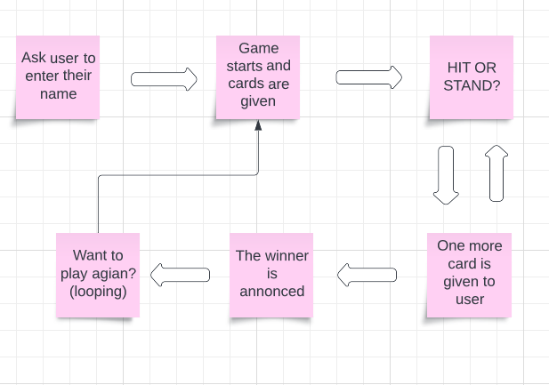

# BlackJack

[LIVE VERSION HERE]()

This is a simple command-line version of the game BlackJack. The game is built only in python and designed to be played in the terminal.

## Rules

The game follows the standard rules of Blackjack. The objective is to have a hand with a higher value than the dealer's, without going over 21.
Face cards are worth 10 points, Aces are worth 1 point, 
and all other cards are worth their face value.

Each player starts with two cards, and can choose to "hit" (draw another card) or "stand" (keep their current hand). The dealer also draws cards, and must continue to hit until their hand is worth at least 12 points.

If a player's hand exceeds 21 points, they lose. If the dealer's hand exceeds 21 points, the player win. 
If the dealer's hand is worth more than a player's, but not more than 21, that player loses. If a player's hand is worth more than the dealer's, 
they win. If a player's hand is worth the same as the dealer's, it is a tie.

## Features

### Welcome screen

Welcome screen introduces the user to the game and asks the user to enter their name.

### Game start

When name is provided, dealer gives two cards to the user and the computer.
The card deck is randomly shuffled after each move in the game so it allways be random cards.
Now you have a choice of either HIT (taking a new card) or STAND.

### HIT OR STAND

If the user wants to hit for a new card then dealer gives out a new random card from deck.
User is going to be asked for a new card until the user dont want more cards.
Computer should only take a new card if a certein creteria is met. 

### The Winner

The winner of the game is based on who is closest to 21 BUT now over 21. See the rules of the game at top of this page.

Now the the total of the users cards value is showing up and declers a winner.

If both the players goes over 21 both lose.

### Continue or Exit

The prompt for playing agian shows up, the user is going to have to either press Y to play again,
or N for exiting the game. The user cant press any other key, it will continue to ask until the user
provides with the right key. 

## Future Features

### Better opponent

The computer is set to just take a card based on just one criteria, to have a better opponent who is based on more then just one crateria,
would make the computer smarter and gives it more a fair opponent to play agianst.

### Scoreboard

Giving it a scoreboard would keep track how many times the user/computer have won.

## Wireframe

Here is the completet wireframe for the project.

Made with lucidchart.

## Techonologies used

Throughout the projects was following technologies used:

- [Python](https://www.python.org)

- [Github](https://github.com/)

- [Git](https://git-scm.com)
To push my project through to github.

- [Heroku](https://heroku.com/)
To deploy my project so it can be used live.

- [Lucidchart](https://lucid.app/)
To make projects wireframe.

- [CI Python Linter](https://pep8ci.herokuapp.com/#)
To look at any errors in project code.

## Testing

Testing has been done every step in the development process.

- Inputs working

- Validation working

- Functions working 

### Known bugs and bug fixes

- Sometimes when user press HIT and computer have a value of more than 12 it should not take more cards but it does.

- When user takes a new card it shows up like a array in the terminal.

Fix:
 
 Fixed using a for loop in get more cards function.

## Linter Python Testing

The Code institutes own [Python Linter tester](https://pep8ci.herokuapp.com/#) was used to test the code at the end of the project. At first it came back with minor blank space errors. Everything was fixed and no error has been found.

## Deployment

This project was deployed using following steps:

1. Login to Heroku

2. Locate the "New" button on Heroku dashboard, towards the top right corner, and select "Create new app".

3. Choose an available name for the app, provide your region and click "Create App"

4. Navigate to app settings tab and add two buildpack scripts in the following order,

 - Python
 - Nodejs

5. Navigate to deployment tab.

6. Under "Deployment method", choose "connect through GitHub" and confirm by clicking the "Connect to GitHub" button.

7. Provide your repository name and click "Search" (If you can't find your repository, check that you've spelled it correctly).

8. Choose and connect the correct repository for the app by clicking the "Connect" button shown beside the repository.

9. Under "Automatic deploys", click the "Enable Automatic Deploys" button.

10. Under "Manual deploy", select the main branch and click the "Deploy Bransh" button (The deployment can take a minute or two).

11. A message will apear informing of a successfully deployment, followed by a link to your live site.

## Credits

Credits for this project is the following:

- [Stack Overflow](https://stackoverflow.com)
 Giving advice to improve thinking when applying it in code.

- Evelina 
 For helping me finding bugs in code.

 - FreeCodeCamp youtube channel
  Helping with fundamentals that I have issues understanding.
 